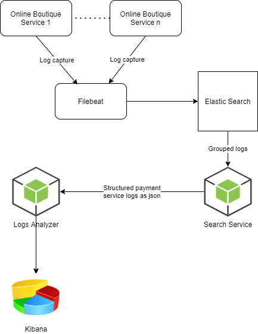

# Microsservices Logs Management

Aplicação para extrair informaçõs de logs de um ecossistema de microsserviços open-source denominado [Online Boutique](https://github.com/GoogleCloudPlatform/microservices-demo), desenvolvido pelo Google Cloud. O projeto visa o desenvolvimento de competencias técnicas relacionadas ao gerenciamento de logs em aplicações distribuídas, bem como estimular a criatividade na extração de informações a partir de dados não estruturados com o objetivo de obter insights de negócio.

## Arquitetura do projeto

O ecossistema de microserviços do online boutique foi hospedado em um serviço de gerenciamento de kubernets no google cloud (GKE).

Dentro do cluster criado, foram incluídos dois outros pods, o Elastic Search e o Filebeat. Este último é uma aplicação responsável por ler o terminal de outputs (stderr) das outras aplicações do cluster e enviar para o Elastic Search.

Foram criados ainda dois serviços node:

- O Search Service é responsável por buscar logs específicos de um determinado microsserviço do online boutique e estruturar suas informações em formato json.

- O Payment Analyser é o serviço que se comunica com o Search Service, obtém logs estruturados do serviço de pagamento e gera uma planilha de informações que será inputada no kibana, onde encontram-se métricas, tais como: quantidade e tipo de moedas transacionadas e quantidade de compras realizadas na aplicação.

## Tutorial de instalação

*\*Indicado para usuários de distribuições linux*

**Requisitos**
- [Docker](https://www.docker.com/products/docker-desktop)
- [Minikube](https://minikube.sigs.k8s.io/docs/start/)
- [Kubectl](https://kubernetes.io/docs/tasks/tools/install-kubectl/)
- [Skaffold](https://skaffold.dev/docs/install/)

1. Inicie o cluster kubernets com o minikube:

`minikube start --cpus=4 --memory 4096 --disk-size 32g`

*\*Esecificações de cpu e memória requeridas pelo Online Boutique*

2. Clone o repositório do Online Boutique:

`git clone https://github.com/GoogleCloudPlatform/microservices-demo.git`

`cd microservices-demo`

3. Dentro da pasta da aplicação execute o comando para incluir todos os pods no cluster:

`skaffold run` (20 min aproximadamente :sweat_smile:)

